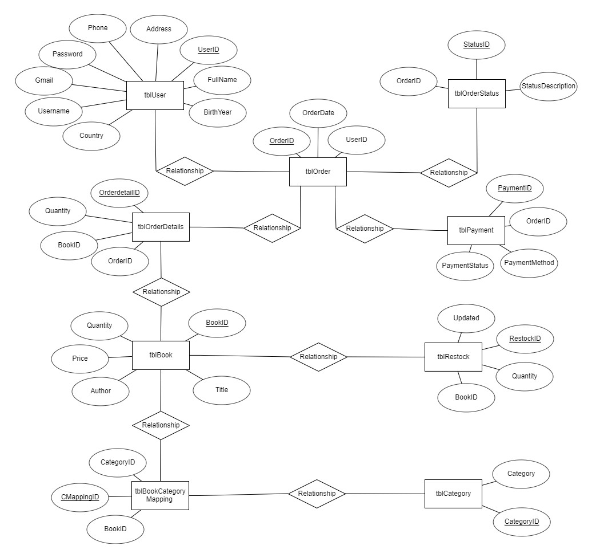
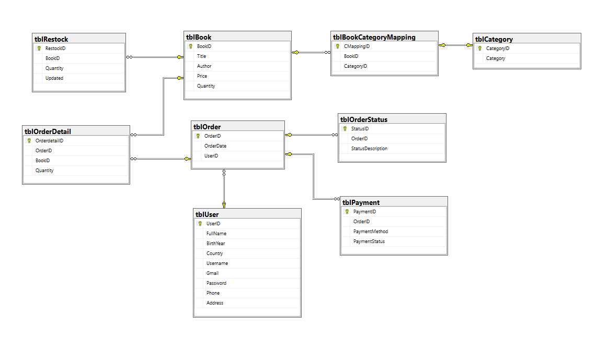

# Overview 

- Project of DBI202:
  - Topic: Bookstore management system
  - Describe: Management for a book-selling website
 
- Members:
  - [Lê Quốc Chính](https://github.com/armytle)-QE170250
  - [Nguyễn Hoàng Việt](https://github.com/sinhvienfpt)-QE180058
  - [Quảng Thành Đô](https://github.com/dolami2876)-QE180117
  - [Huỳnh Hữu Hiếu](https://github.com/hieuxinloi)-QE180067
  - [Nguyễn Tấn Thắng](https://github.com/thangthewinner)-QE180019
   
- Technologies used:
  - Language: Python (Pandas)
  - Database: SQL Server
   
- Source code: https://github.com/groupvz/BOOK_STORE

# 1. Problem Statement:
- In the modern age of technology, the Internet has played a significant role in people's lives. It has greatly improved the quality of life and standards of living for many individuals. The Internet has expanded into various fields and levels. E-commerce is one of the sectors that has emerged in recent years. Online bookstores have helped many book lovers by making it easy for them to purchase books online. Sometimes it is not convenient to visit a traditional bookstore, as it is limited by operating hours, the availability of a specific book, its location, and most importantly, the necessary space to store many books. Such limitations have led to the development of e-commerce industries related to bookstores. Our project is to create a database for a simple e-commerce website, containing various types of books so that consumers can shop online.

# 2.Describing the system's features:
## 2.1. Book Management:
- Add books:
	+ Administrators have the right to add information about new books to the system.
	+ Required information includes book title, author, price, inventory quantity, and other details.
- Edit books:
	+ Administrators have the right to edit information about books.
	+ Update information such as book title, author, price, inventory quantity, and other details.
- Delete books:  Administrators can delete book information from the system.
- Update quantity: The system will update the quantity of books remaining in stock.
  
## 2.2. Book Category Management:
- Create book categories:
	+ Administrators have the right to create new book categories.
	+ Each category has a name to describe its content.
- Manage book categories:
	+ Administrators have the ability to add or delete books from categories.
	+ Users can search for books based on categories for easy browsing and selection.

## 2.3. Customer Management:
- Manage personal information:
	+ The system will update basic customer information when customers fill out information in the purchase form.
	+ For convenience in contacting to confirm orders and identify returning customers.
- Registration:
	+ Customers can register an account on the website.
	+ Required information includes username, password, first and last name, email, address, and phone number.
- Login: Users can log in with their username and password.
  
## 2.4. Order Processing:
- Receive orders:
    + The system receives orders from users after they have selected books and proceeded to payment.
    + Record information about the order, the products ordered, and customer contact information.

## 2.5. Order Status Management:
- Update order status:
    + Administrators can update the status of orders from "Processing" to "Shipped" and "Received."
    + The system automatically updates the status based on the order processing.

## 2.6. Payment:
- Payment processing:
    + The system processes payments for orders using online payment methods such as credit cards, e-wallets, or direct payments.
    + Record payment information and update the payment status of orders.

## 2.7. Statistical Reporting:
- Export daily, monthly, yearly reports:
	+ Revenue report.
	+ Report on the number of books sold.
	+ Report on the number of customers.
	+ Books with the highest sales.
	+ Top purchasing customers.

# 3. Plans, Tools:
## 3.1. Plan:
## 3.2. CASE Tools:
- IDE: Visual Studio

- Data sources: Kaggle 

- Code Repositories: Github

- Issues tracking: GitHub

# 4. Data design
## 4.1. Entity-relationship Model

## 4.2. Diagram

## 4.3. Data Dictionary
### tblBook
| Field name | Data type          | Constraint                   | Description             |Example
|----------------|---------------|-----------------------------|-----------------------------|-----------|
| BookID| INT  | PRIMARY KEY                | ID number of a book in the store      |1
| Title     | TEXT | NOT NULL                   | Title of a book |The Missing Person
| Author| TEXT  |     NOT NULL         | Show full name of the author|By Grumbach, Doris
| Price     | FLOAT |             NOT NULL      | pre-tax cost of a book(USD) |4.99
| Quantity     | INT |        >=0           | Number of books remaining |20

### tblBookCategoryMapping
| Field name | Data type          | Constraint                   | Description             |Example
|----------------|---------------|-----------------------------|-----------------------------|-----------|
| CMappingID| INT  | PRIMARY KEY                | the unique id of the book's category (sometimes a book has more than one category)     |15
| BookID| INT  | FOREIGN KEY to table Book('BookID')              |     |8
| CategoryID| INT  | FOREIGN KEY to table Category('CategoryID')    ||379

### tblCategory
| Field name | Data type          | Constraint                   | Description             |Example
|----------------|---------------|-----------------------------|-----------------------------|-----------|
| CategoryID 	| INT	|PRIMARY KEY	| A unique id of category	|12
| Category	| NVARCHAR(100)		|             |Name of a category	|Architects

							
### tblUser
| Field name | Data type          | Constraint                   | Description             |Example
|----------------|---------------|-----------------------------|-----------------------------|-----------|
| UserID   | INT | PRIMARY KEY                 | ID number of a client      |231747
| BirthYear   | SMALLINT | >=1900           | User's year of birth    |1999
| Username | NVARCHAR(50)    | NOT NULL                    | Username of the user       |kylianmbapp1999	
| Password | NVARCHAR(50)   | NOT NULL                    | Password of the user (encrypted) |#0000004D
| Full name | NVARCHAR(50)   | NOT NULL                    | Full name of the user      |Kylian Mbappé
| Email    | NVARCHAR(100)   |             NOT NULL        | Email address of the user  |kylianmbapp1999@gmail.com
| Phone    | NVARCHAR(15)   |             NOT NULL        | Telephone number of the user |9126470042
| Address   | NVARCHAR(255)  |		  NOT NULL	  | User's residential address	 |700 Oak Street, Brockton, MA, 2301
| Country   | NVARCHAR(50)   | 		  NOT NULL        | Countries of users		 |USA

### tblOrder
| Field name | Data type          | Constraint                   | Description             |Example
|----------------|---------------|-----------------------------|-----------------------------|-----------|
| OrderID 	| INT	|PRIMARY KEY	| a unique ID that assigned to each order	|77
| UserID	| INT		| 	FOREIGN KEY to table User('UserID')      |	|216354
| OrderDate	| DATE	| 	NOT NULL     |The date the user placed the order 	|2022-01-01 

### tblOrderDetail
| Field name | Data type          | Constraint                   | Description             |Example
|----------------|---------------|-----------------------------|-----------------------------|-----------|
| OrderDetailID 	| INT	|PRIMARY KEY	| A unique ID that is assigned to each order detail	|128
| OrderID	| INT		| 	FOREIGN KEY to table Order('OrderID')      |	|97
| BookID	| INT		| 	FOREIGN KEY to table Book('BookID')      |	|809
| Quantity	| INT		| 	  >=0   | How many book the user ordered	|7

### tblOrderStatus
| Field name | Data type          | Constraint                   | Description             |Example
|----------------|---------------|-----------------------------|-----------------------------|-----------|
| StatusID 	| INT	|PRIMARY KEY	| the unique id of the order status	| 19
| OrderID	| INT		| 	FOREIGN KEY to table Order('OrderID')      |	| 124
| StatusDescription	| NVARCHAR(20)		| 	    NOT NULL | 	Description of order status (Processing, Sent, Received)|Shipped

### tblPayment
| Field name | Data type          | Constraint                   | Description             |Example
|----------------|---------------|-----------------------------|-----------------------------|-----------|
| PaymentID 	| INT	|PRIMARY KEY	| a unique ID that assigned to a payment	|18
| OrderID	| INT		| 	FOREIGN KEY to table Order('OrderID')      |	|41
| PaymentMethod	| NVARCHAR(20)		|  NOT NULL	     | Buyer's payment method	|Cash
| PaymentStatus	| NVARCHAR(20)		| NOT NULL	     | 	Has the order been confirmed or not?|Completed

### tblRestock
| Field name | Data type          | Constraint                   | Description             |Example
|----------------|---------------|-----------------------------|-----------------------------|-----------|
| RestockID 	| INT	|PRIMARY KEY	| code of the time the goods are imported into the warehouse	|155
| BookID	| INT		| 	FOREIGN KEY to table Book('BookID')      |	|123
| Quantity	| INT		| 	 >=0    | Number of books restocked	|25
| UpdatedDate	| DATE		| 	 NOT NULL    | The date the book was restocked	|2022-02-13
